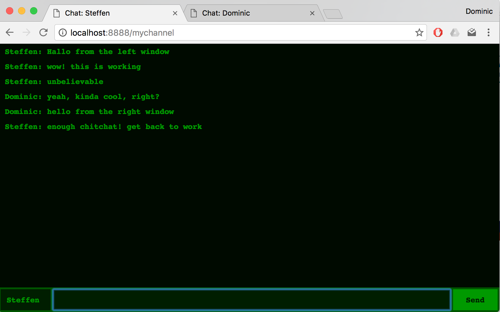

# Socket.io chat example

This is a simple chat application built with socket.io.
People can connect to chatrooms and messages are broadcast within these rooms
to all connected browser windows.

## Try it out

Make sure you have Docker installed to start the server.
Use `bin/run.sh` to start the server, which will take care of building the
Docker image and starting the server.
Then go to http://localhost:8888/channel1 to join `channel1`.
You can start chatting.

Open another browser window, go to the same channel, and you get a new identify.
Both identities can now chat with each other.
Identities are simply random numbers in [0, 1000] generated when you open
the browser window.

